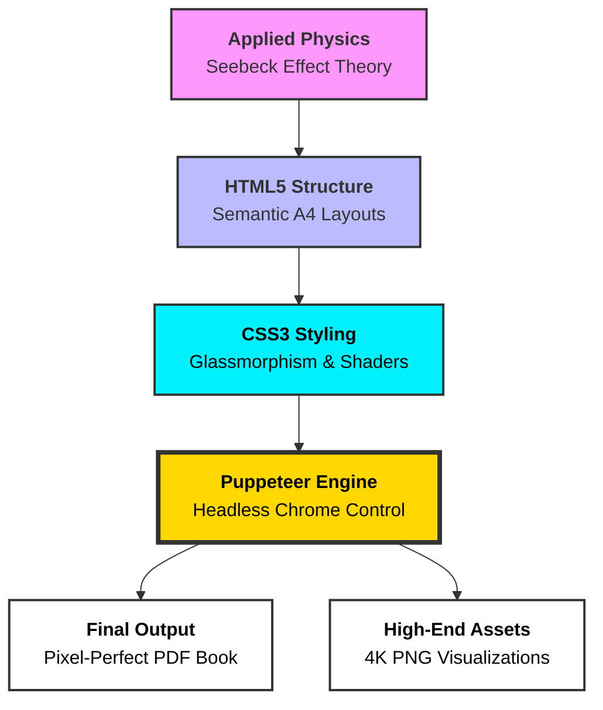

<div align="center">

# 💎 Thermoelectric Generator: Electricity from Heat
### A Fusion of Applied Physics & High-End Web Engineering

[](index.html)
[](presentation.html)
[](https://uoc.ac.in/)

<br>

**"Engineering the energy transition through pixel-perfect thermal harvesting."**

---

</div>

## 🌊 Liquid Glass & Gold Shader Aesthetics

This project transcends traditional academic reporting by implementing a **Custom UI Engine**. The digital experience features:

*   **Liquid Glass Shaders**: Glassmorphism effects with real-time backdrop filtering, creating a translucent, fluid interface that feels alive.
*   **Gold Shiny Animations**: Specialized CSS3 keyframes that simulate metallic luster and "shiny" light sweeps across critical data points.
*   **Animated Mesh Gradients**: Deep-background shaders that drift across the presentation, ensuring a premium, high-stakes visual feel.

---

## 🛠️ Technical Architecture (The Web-Path)

Traditional tools like **PowerPoint** and **Word** were bypassed due to significant limitations in layout precision and the manual time-sink of formatting. Instead, a **"Web-to-Print"** engine was developed:

### The Tree Flow Diagram


---

## 🔬 System Workflow

| Phase | Technical Layer | Result |
| :--- | :--- | :--- |
| **I. Core Theory** | Thermodynamics / Seebeck Effect | Mathematical modeling of Delta-T to EMF. |
| **II. UI Design** | HTML5 / CSS3 / Glass Shaders | Premium visual interface with fluid layout. |
| **III. Automation** | Node.js / Google Puppeteer | Programmatic conversion of web code to static documents. |
| **IV. Precision** | Print-Media CSS Queries | Pixel-perfect A4 report book with zero formatting drift. |

---

## 🏛️ Institutional Credits & Recognition

This research is conducted under the esteemed standards of **Calicut University** and hosted by **Mar Dionysius (MD) College, Pazhanji**.

*   **University**: [Calicut University](https://uoc.ac.in/) (Academic Validation)
*   **College**: [Mar Dionysius College, Pazhanji](http://mdcollege.edu.in/) (Research Infrastructure)
*   **Department**: Department of Physics (Technical Support)
*   **Project Guide**: **Mrs. Rose Jose** *(Assistant Professor)*
*   **Head of Dept**: **Asst. Prof. Smt. Sreeakala R**

**Project Team:** Vipin Krishna T.P, Muhammed Sinan P.S, Devadath C.M, Hana, Aparna T.M, Kiran.

---

## 📈 Executive Summary

*   **Self-Sustaining**: The system powers its own 12V active cooling fan through harvesting extreme heat.
*   **Verification**: Successfully charged modern smartphones directly from a candle flame.
*   **Innovation**: Replaced standard report-writing tools with a custom automated web-engine for superior documentation.

---

## 🚀 Deployment & Generation

To experience the premium animations or generate the final report:

```bash
# Clone the repository
git clone https://github.com/kiran-embedded/thermoelectric-generator.git

# Install the Automated Web Engine
npm install

# Generate the 25-page Pixel-Perfect Report
node export-pdf.js
```

<div align="center">

*Academic Year 2025–2026*  
**Physics. Engineering. Aesthetics.**

</div>
