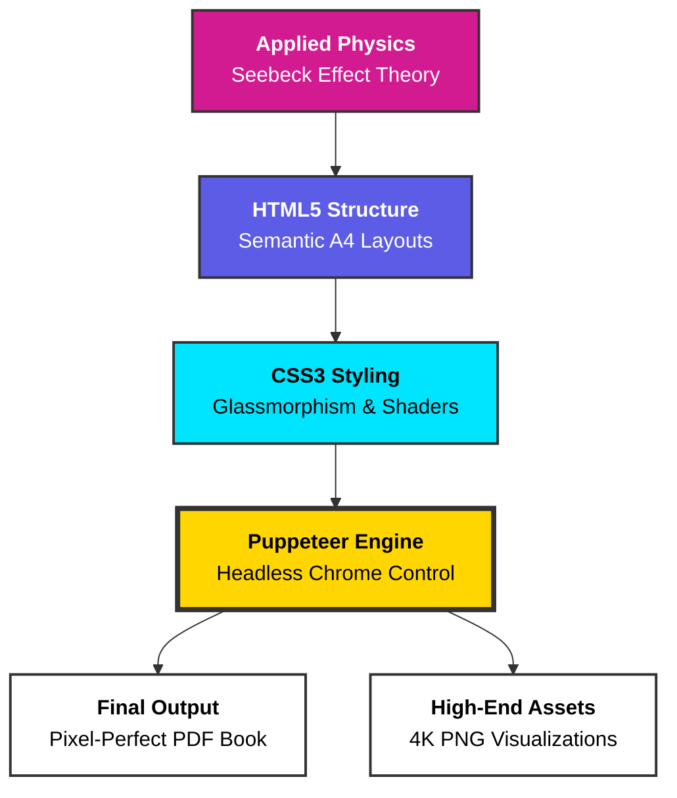

<div align="center">


# 💎 Thermoelectric Generator: Electricity from Heat
### A Fusion of Applied Physics & High-End Web Engineering

[](index.html)
[](presentation.html)
[](https://uoc.ac.in/)

<br>

**"Engineering the energy transition through pixel-perfect thermal harvesting."**

---

</div>

## 🌊 Liquid Glass & Gold Shader Aesthetics

While the **Academic Report** focuses on clean, high-contrast typography for university submission, the **Digital Presentation Engine** implements a **Custom Shader-Inspired UI**:

*   **Liquid Glass Shaders**: Real-time backdrop filtering (glassmorphism) in the presentation creates a translucent, fluid interface.
*   **Gold Shiny Keyframes**: Specialized CSS3 animations that simulate metallic luster and "shiny" light sweeps across critical components.
*   **Animated Mesh Gradients**: Deep-background shaders that drift across the presentation slides for a premium feel.

---

## 🛠️ Technical Architecture (The Web-Path)

Traditional tools like **PowerPoint** and **Word** were bypassed due to their lack of layout precision and manual time-sink. Instead, we built a custom **"Web-to-Print"** workflow:

### System Architecture Flow


---

## 🔬 System Workflow

| Phase | Technical Layer | Result |
| :--- | :--- | :--- |
| **I. Core Theory** | Thermodynamics / Seebeck Effect | Mathematical modeling of Delta-T to EMF. |
| **II. UI Design** | HTML5 / CSS3 / Glass Shaders | Premium visual interface with fluid layout. |
| **III. Automation** | Node.js / Google Puppeteer | Programmatic conversion of web code to static documents. |
| **IV. Precision** | Print-Media CSS Queries | Pixel-perfect A4 report book with zero formatting drift. |

---

## 🏛️ Institutional Credits & Recognition

This research is conducted under the esteemed standards of **Calicut University** and hosted by **Mar Dionysius (MD) College, Pazhanji**.

*   **University**: [Calicut University](https://uoc.ac.in/) (Academic Validation)
*   **College**: [Mar Dionysius College, Pazhanji](http://mdcollege.edu.in/) (Research Infrastructure)
*   **Department**: Department of Physics (Technical Support)
*   **Project Guide**: **Mrs. Rose Jose** *(Assistant Professor)*
*   **Head of Dept**: **Asst. Prof. Smt. Sreeakala R**

**Project Team:** Vipin Krishna T.P, Muhammed Sinan P.S, Devadath C.M, Hana, Aparna T.M, Kiran.

---

## 🚀 Deployment & Generation

To experience the premium animations or generate the final report:

```bash
# Clone the repository
git clone https://github.com/kiran-embedded/thermoelectric-generator.git

# Install the Automated Web Engine
npm install

# Generate the 25-page Pixel-Perfect Report
node export-pdf.js
```

<div align="center">

*Academic Year 2025–2026*  
**Physics. Engineering. Aesthetics.**

</div>
