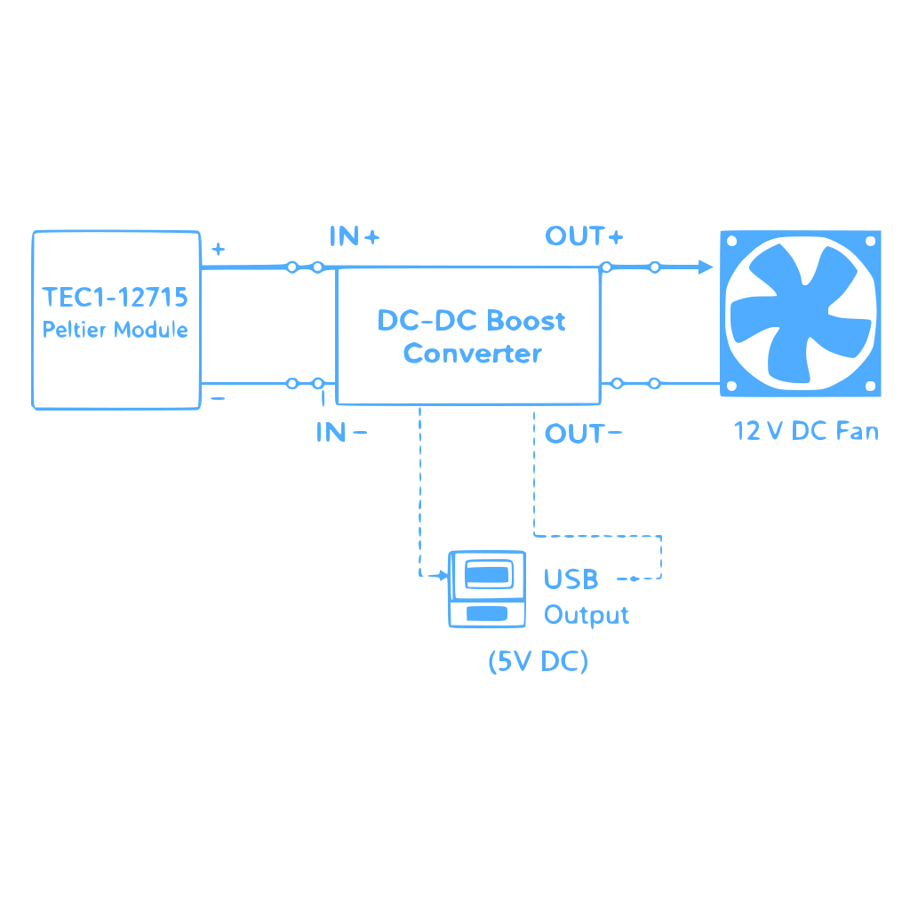
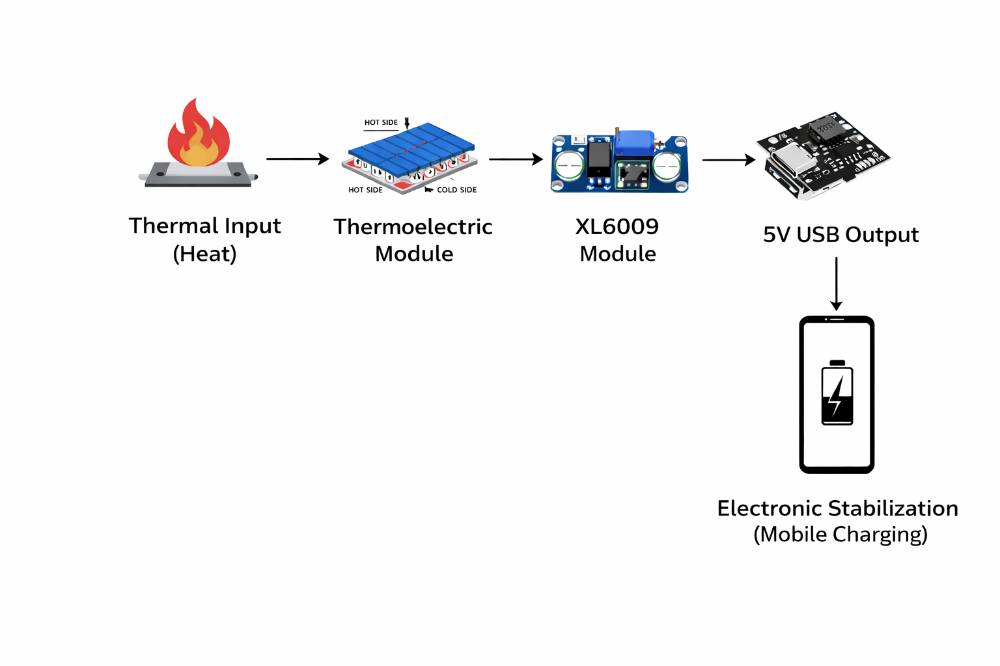

<div align="center">


### B.Sc Physics Project | University of Calicut

[](export-pdf.js)
[](index.html)
[](#ffmpeg-lossless-extraction)

<br>

**"A professional synthesis of thermal thermodynamics, modern web-to-print automation, and lossless media processing."**

---

</div>

## 🔬 Core Circuitry & Logic

The system is engineered for reliable energy harvesting. Below is the primary circuit architecture and the operational flow of the TEG system.

<div align="center">
  
  <p><i>Figure 1: System Circuit Schematic (High Fidelity - Blue Trace)</i></p>
  
  <br>
  
  
  <p><i>Figure 2: Power Regulation & Distribution Flow</i></p>
</div>

---

## 🏗️ Technical Architecture (Web-to-Print)

Traditional tools like PowerPoint or Word often struggle with layout precision and automated scaling. This project solves that by using a **High-Fidelity Web Engine**:

*   **Pixel-Perfect Report**: `index.html` is tailored for A4 printing (210mm x 297mm) with professional typography (Times New Roman & Cinzel).
*   **Digital Presentation Engine**: Features a modern interface with glassmorphism-inspired effects (backdrop-filters) and smooth CSS3 transitions.
*   **Headless Automation**: **Node.js** and **Google Puppeteer** are used to programmatically convert code into a 25-page academic report book and high-resolution visuals.

---

## 🎞️ FFmpeg Lossless Extraction

To ensure the highest quality documentation, experimental videos were processed using **FFmpeg** to extract frames without quality loss. This allows for clinical-grade imagery in the final report book.

```bash
# Extract high-quality frames from experimental video
ffmpeg -i experimental_video.mp4 -q:v 2 -f image2 svg/frame_%03d.png
```
*Benefits: Zero compression artifacts, precise frame control, and automated batch processing.*

---

## 📂 Project Structure

```bash
.
├── 📄 index.html                # Main Academic Report Book (25 Pages)
├── 🎬 presentation.html          # Digital Suite (Refined UI & Transitions)
├── ⚡ export-pdf.js              # Automation Engine (Headless PDF Export)
├── 📁 svg/                      # Asset Pool (Schematics, Photos, Branding)
│   ├── circuit-diagram.svg      # Primary Electrical Schematic (Fixed Visibility)
│   ├── animated-heading.svg     # Gold Shiny Animated Heading
│   └── operational-flow.png     # System Logic Flowchart
└── 📦 package.json              # System Dependencies (Puppeteer)
```

---

## 🚀 How to Build

To generate the final report locally, ensure you have **Node.js** installed:

1.  **Install Dependencies**: `npm install`
2.  **Generate Report**: `node export-pdf.js`

---

## 🏛️ Credits & Institutional Branding

This project was developed at **Mar Dionysius (MD) College, Pazhanji** in accordance with the standards of **Calicut University**.

*   **Head of Department**: **Asst. Prof. Smt. SREEKALA R**
*   **Project Guide**: **Mrs. ROSE JOSE** (Assistant Professor)
*   **Project Team**: Vipin Krishna T.P, Muhammed Sinan P.S, Devadath C.M, Hana, Aparna T.M, Kiran.

---

<div align="center">

*Academic Year 2025–2026*  
**Applied Science. Precision Engineering. Media Excellence.**

</div>
